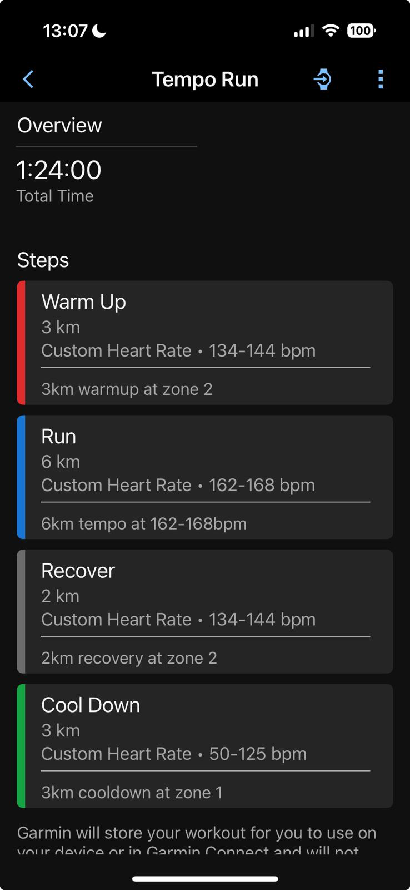

# Marathon Training Plan Scheduler

A Python CLI tool that schedules marathon training plans from markdown files to Garmin Connect using the Garmin Workouts MCP server.


## Why?

I got tired of clicking through 47 menus just to create a simple interval workout in Garmin Connect. So I built garmin-workouts-mcp - a Python tool that turns Markdown files into Garmin workouts and syncs them automatically. As an amateur runner with decent fitness (VO2max 57), I decided to get serious about structured training this year. Problem: I started late, and Garmin's built-in plans are about as flexible as a brick. They wanted me doing base-building when I needed to be ramping up intensity. The web interface for creating custom workouts feels like it was designed by someone who hates both runners and UI design. The tool uses the MCP protocol to integrate with Claude code, so you can describe workouts in plain English. Write "5x1km at threshold with 2min rest" in a Markdown file, run the command, and it appears in Garmin Connect. I've included my own `training_plan.md` in the repo. Fair warning: it's cobbled together from various articles and optimistic assumptions about my abilities. Feel free to roast my questionable periodization choices and overly ambitious interval sessions.

## Features

- Parses structured markdown tables containing training plan data
- Converts natural language workout descriptions to Garmin-compatible format
- Schedules workouts automatically to Garmin Connect
- **Idempotent scheduling**: Skips workouts that already exist and match
- **Post-scheduling validation**: Verifies all workouts are correctly scheduled
- Provides dry-run mode for testing
- Beautiful terminal output with progress tracking
- Retry logic for failed operations

## Installation

1. Install the package with its dependencies:
```bash
pip install -e .
```

2. Set up Garmin Connect credentials (same as for the MCP server):
```bash
export GARMIN_EMAIL="your_email@example.com"
export GARMIN_PASSWORD="your_password"
```

## Usage

### Basic Usage

Schedule a training plan from a markdown file:
```bash
python -m garmin_workouts_mcp.schedule_training_plan training_plan.md
```

### Dry Run Mode

Preview what will be scheduled without making changes:
```bash
python -m garmin_workouts_mcp.schedule_training_plan training_plan.md --dry-run
```

### Verbose Mode

Get detailed logging information:
```bash
python -m garmin_workouts_mcp.schedule_training_plan training_plan.md --verbose
```

## Markdown Format

The training plan should be formatted as markdown tables with the following columns:

| Date | Day | Session | Distance | Heart Rate Target | Garmin MCP Description | Time |
|------|-----|---------|----------|-------------------|------------------------|------|
| Jul 21 | Mon | Recovery Run | 8km | Zone 1: <125 bpm | "8km recovery run at zone 1 heart rate under 125bpm" | 7:00 AM |

### Required Columns:
- **Date**: Format as "Mon DD" (e.g., "Jul 21")
- **Day**: Day of week
- **Session**: Name of the workout
- **Distance**: Distance with unit (e.g., "8km", "21km")
- **Heart Rate Target**: Target heart rate or zone
- **Garmin MCP Description**: Natural language description in quotes
- **Time**: Time of day (optional)

## Supported Workout Types

The scheduler uses claude code cli to inteligently interpret and create various workout types:

### Simple Workouts
- Recovery runs: "8km recovery run at zone 1"
- Easy runs: "10km easy run at zone 2"
- Long runs: "30km long run at zone 2"

### Structured Workouts
- Tempo runs: "3km warmup, 6km tempo at 162-168bpm, 3km cooldown"
- Intervals: "2km warmup, 6x(1km at 170bpm, 90sec recovery), 2km cooldown"
- Norwegian 4×4: "3km warmup, 4x(4min at 175-180bpm, 3min recovery), 2km cooldown"

### Heart Rate Targets
- Zones: "zone 1", "zone 2", etc.
- Ranges: "162-168bpm"
- Limits: "under 125bpm", "below 135bpm"

## Implementation Details


### Key Components
1. `models.py`: Pydantic models for training data
2. `utils.py`: Markdown parsing and workout conversion
3. `schedule_training_plan.py`: Main CLI implementation

### Idempotent Scheduling
The scheduler is idempotent, meaning you can run it multiple times safely:
- Checks if a workout already exists on each date
- Compares existing workouts with planned workouts
- Only schedules new workouts or replaces non-matching ones
- Skips scheduling if the existing workout matches

### Validation Phase
After scheduling, the tool validates all workouts:
- Verifies each training date has a scheduled workout
- Checks that workouts can be retrieved from Garmin
- Reports any missing or invalid workouts
- Provides a validation summary at the end

### Error Handling
- Validates markdown format before processing
- Handles authentication failures gracefully
- Retries failed operations up to 3 times
- Provides clear error messages

## Example Output

```
╭──────────────────────────────────────────────────────────────────────────────╮
│ Marathon Training Plan Scheduler                                             │
│                                                                              │
│ Reading: training_plan.md                                                    │
╰──────────────────────────────────────────────────────────────────────────────╯

Training Plan Summary
┏━━━━━━━━━━━━━━━━┳━━━━━━━━━━━━━━━━━━━━━━━━━━━━━━━━━━━━━━━━━━━━━━━━━━━━━━━━━━━━━┓
┃ Property       ┃ Value                                                       ┃
┡━━━━━━━━━━━━━━━━╇━━━━━━━━━━━━━━━━━━━━━━━━━━━━━━━━━━━━━━━━━━━━━━━━━━━━━━━━━━━━━┩
│ Title          │ Marathon Training Plan                                      │
│ Start Date     │ 2025-07-21                                                  │
│ End Date       │ 2025-09-28                                                  │
│ Total Weeks    │ 10                                                          │
│ Total Sessions │ 70                                                          │
└────────────────┴─────────────────────────────────────────────────────────────┘

Scheduling workouts...
✓ Scheduled 2025-07-21: Recovery Run
⟳ Exists 2025-07-22: Tempo Run (matched)
✓ Scheduled 2025-07-23: Easy Aerobic
... 

Scheduling Summary:
  ✓ Newly scheduled: 45
  ⟳ Already existed (matched): 25
  ○ Rest days: 2
  ✗ Failed: 0

Validating scheduled workouts...
✓ Validated 2025-07-21: Recovery Run
✓ Validated 2025-07-22: Tempo Run
...

Validation Summary:
  ✓ Validated: 70
  ✗ Validation failed: 0
```

## Example session uploaded to Garmin Connect

Here' the first session of my plan uploaded to Garmin Connect:


